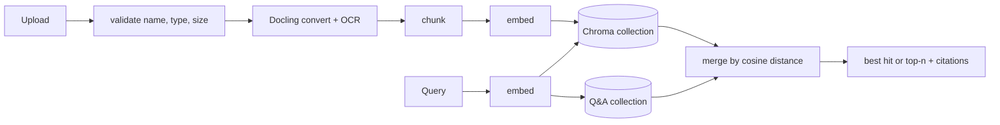

# Multi-Collection RAG API

A document search service for mixed internal documents — manuals, policies,
contracts — where each document type gets its own collection and chunking, and
curated Q&A answers compete with document passages in a single ranked result.

**Stack:** FastAPI · Docling (PDF/DOCX/PPTX/HTML/MD/TXT, OCR for scanned PDFs) ·
ChromaDB · OpenAI `text-embedding-3-small` · LangFuse tracing (optional)

## What it does

- **Collections per document type.** A policy handbook and a device manual chunk
  differently; each collection keeps its own strategy and chunk size, persisted in
  Chroma so a restart re-attaches it exactly as created.
- **Structure-aware chunking** via Docling:
  - `hybrid` — follows headings/paragraphs/tables, then splits or merges to at most
    `chunk_size` tokens, counted with the embedding model's own tokenizer (`cl100k_base`)
  - `hierarchical` — one chunk per structural element, no size cap
- **Curated Q&A.** Store question/answer pairs; they are embedded and ranked on the
  same cosine scale as document chunks, so a human-written answer wins when it is the
  closest match.
- **Citations.** Every result carries filename, collection, document type and page
  number (for paged formats).
- **Incremental ingestion.** Files are SHA-256 hashed; unchanged files are never
  re-embedded, and re-indexing replaces a file's old chunks instead of duplicating them.



## Run it

```bash
python -m venv venv && source venv/bin/activate
pip install -r requirements.txt
cp .env.example .env     # add OPENAI_API_KEY
uvicorn app.main:app --reload     # http://localhost:8000/docs
```

The first PDF triggers a one-off download of Docling's layout/OCR models.

```bash
# Upload into a collection (created on first use)
curl -F file=@handbook.pdf -F folder_name=hr-policies -F doc_type=policy \
  localhost:8000/api/documents

# Add a curated answer
curl -H 'Content-Type: application/json' localhost:8000/api/qa \
  -d '{"question": "How many vacation days do I get?", "answer": "25 per year.", "tags": ["hr"]}'

# Search everything (best hit), or everything up to n_results
curl -H 'Content-Type: application/json' localhost:8000/api/query \
  -d '{"query_text": "vacation carry-over", "return_all": true, "n_results": 5, "doc_types": ["policy"]}'
```

### Endpoints

| | Path | |
|---|---|---|
| `POST` | `/api/documents` | Upload + index (multipart: `file`, `folder_name`, `doc_type`, `title`, `description`) |
| `GET` `PUT` `DELETE` | `/api/documents[/{id}]` | List / get, update metadata or move to another collection (re-indexes), delete file + chunks |
| `POST` `GET` `DELETE` | `/api/qa[/{id}]` | Curated Q&A pairs (`limit` / `offset` paging) |
| `POST` | `/api/query` | Search documents and Q&A; filter by `collections`, `doc_types` |
| `GET` `POST` | `/api/collections[/{name}]` | List, inspect, create with `chunking_strategy` + `chunk_size` |
| `GET` | `/health`, `/health/langfuse` | Liveness, tracing status |

## Security

- Collection names are restricted to `[A-Za-z0-9_-]` (3–63 chars) and every path is
  resolved and checked against the documents directory, so neither a collection name
  nor an uploaded filename can write outside it.
- Uploads are limited by extension and size (`MAX_UPLOAD_MB`, default 25).
- Set `API_KEY` to require an `X-API-Key` header on every `/api` route
  (constant-time comparison). `X-User-Id` is only a label for traces, never used for access.
- Errors are logged server-side; clients get a generic message, never exception text.
- CORS origins are configurable (`CORS_ORIGINS`); credentials are not allowed.

## Tests

```bash
pip install -r requirements-dev.txt
pytest -q
```

38 tests run against **real Chroma and real Docling** with OpenAI embeddings replaced
by a deterministic bag-of-words hash, so they need no API key. They cover path
traversal and upload limits, API-key auth, error redaction, ingestion and
re-indexing, filename collisions, moving and deleting documents, restart
persistence, filtering, and Q&A ranking against documents.

## Layout

```
app/            FastAPI app: routes, settings, validation, services
rag_package/    the reusable library (collections, Docling processing, chunkers, cache)
examples/       using rag_package without the API
tests/
```

## Limitations

- Single process: the document registry is a JSON file and the vector store is local
  Chroma — no multi-worker or multi-instance deployment.
- One shared API key rather than per-user auth; no rate limiting.
- Retrieval only — the API returns ranked passages and citations; answer generation
  is left to the caller.
